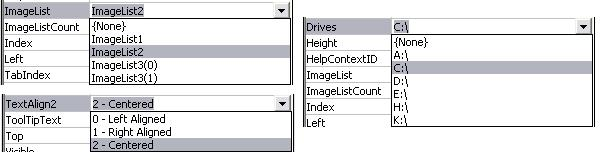



## FYI: UserControl Custom DropDowns \- PropetySheet

### Description

A "fluff" tool for usercontrol developers. With the attached, one can easily supply their own custom dropdown lists for propertysheets. If a property is a VB enumeration (say AlignmentConstants), you normally get values like: vbLeftJustify, vbRightJustify, vbCenter for the property's dropdown and its displayed value. Wouldn't it be cool if it was displayed like this instead: Left, Right, Centered? Easy. Ever want or need a string enumeration, say a list of controls on the form or a list of available drives? Easy. Want to display your own dialog box for a property vs a property sheet? Say a FileName property that opens a commondialog? Easy. The attached has a sample project that shows how this can be done. 18 Dec 08... Found memory related bugs that crash. Thunks &amp; mapped memory file modified as needed. Now tested compiled/uncompiled and in other apps (MSAccess). No more crashing; no errors noticed.
 
### More Info
 

             |
---                |---
**Submitted On**   |2008-12-18 09:33:14
**By**             |[LaVolpe](https://github.com/Planet-Source-Code/PSCIndex/blob/master/ByAuthor/lavolpe.md)
**Level**          |Advanced
**User Rating**    |5.0 (25 globes from 5 users)
**Compatibility**  |VB 6\.0
**Category**       |[VB function enhancement](https://github.com/Planet-Source-Code/PSCIndex/blob/master/ByCategory/vb-function-enhancement__1-25.md)
**World**          |[Visual Basic](https://github.com/Planet-Source-Code/PSCIndex/blob/master/ByWorld/visual-basic.md)
**Archive File**   |[FYI\_\_UserC21374812182008\.zip](https://github.com/Planet-Source-Code/lavolpe-fyi-usercontrol-custom-dropdowns-propetysheet__1-71520/archive/master.zip)

